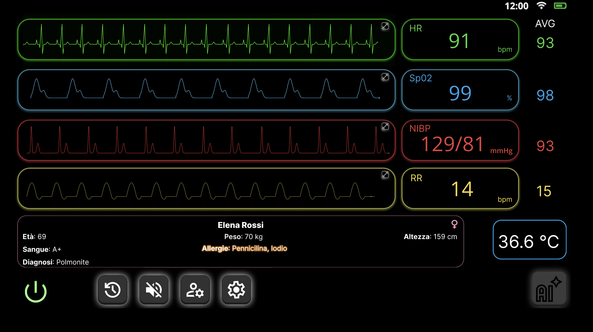

# 🏥 Smart HMI for Intensive Care Units (ICU)
> Un'interfaccia cooperativa basata sull'Intelligenza Artificiale, progettata per mitigare l'Alarm Fatigue nelle Terapie Intensive attraverso principi di Human-Centered Design.

## 📌 Prova il Prototipo
**[➡️ Clicca qui per testare il prototipo interattivo ad alta fedeltà su Figma]([INCOLLA-QUI-IL-LINK-DI-FIGMA])**

## 🎯 Il Problema: L'Alarm Fatigue
Nelle Unità di Terapia Intensiva moderne, i monitor tradizionali generano un carico cognitivo enorme (Workload) a causa di interfacce caotiche e allarmi basati su singole soglie fisse isolate. Statistiche cliniche indicano che oltre l'85% di questi allarmi acustici costituisce un falso positivo. Questo inquinamento acustico costante genera **Alarm Fatigue**, desensibilizzando il personale medico ed esponendo i pazienti a stress psicofisico e potenziali errori clinici (bias di sistema 1).

## 💡 La Soluzione Progettuale
Questo progetto propone un Monitor Multiparametrico Intelligente capace di passare da un paradigma reattivo a uno proattivo, agendo non come mero erogatore di dati grezzi, ma come strumento di supporto decisionale per infermieri e medici.

### 🤖 L'Intelligenza Artificiale in Azione (Focus Mode)
Quando il motore predittivo rileva un'anomalia clinica reale incrociando i parametri con la cartella clinica, l'HMI applica il concetto di *Variabilità Interazionale*: nasconde i dati secondari ed esalta i parametri in pericolo, fornendo una diagnosi in linguaggio naturale (Explainable AI).

### ⚙️ Core Features & Engineering Principles
*   📐 **Spatial Organization & Gestalt:** Il layout adotta un'architettura modulare a corsie orizzontali ("Swimlane"). Questo accoppiamento funzionale tra onda morfologica e valore numerico abbatte il rischio di errori di lettura incrociata, rispettando i limiti della memoria a breve termine (Miller's Law).
*   🛡️ **Human-in-the-Loop & UX Guardrails:** Il sistema agisce solo come amplificatore cognitivo. Nessuna decisione autonoma viene presa dall'IA. Dialoghi di conferma (*Acknowledgment* obbligatorio) impediscono la modifica involontaria delle soglie, mitigando l'Automation Bias.
*   ⚖️ **Compliance Normativa (IEC 60601-1-8):** L'uso dello Sfondo Nero Nativo (Dark Mode) massimizza il contrasto visivo notturno, mentre la codifica cromatica e l'uso di nuove *Auditory Icons* (suoni morbidi e non ansiogeni per gli avvisi tecnici) rispettano rigorosamente le direttive internazionali per la strumentazione biomedica.

## 📄 Documentazione Accademica
Il razionale teorico, lo studio delle Personas, le mitigazioni dell'Audit e le scelte ergonomiche dettagliate sono disponibili nella presentazione completa del progetto:
**[➡️ Scarica o visualizza la presentazione del progetto (PDF)]([SCRIVI-QUI-IL-NOME-DEL-TUO-PDF.pdf])**

## 👥 Il Team
Progetto sviluppato per il corso di *HMI for Digital Application* (Università degli Studi di Modena e Reggio Emilia) da:
*   Francesco D'Asaro
*   Mattia Splendiani
*   Valerio Barra
